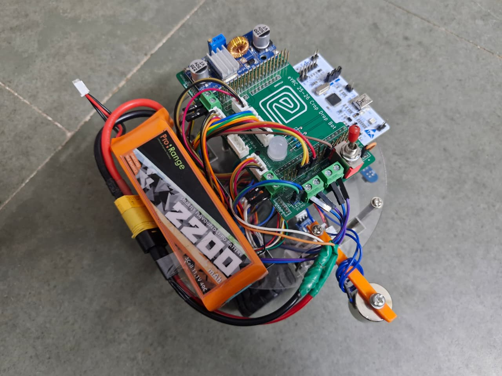
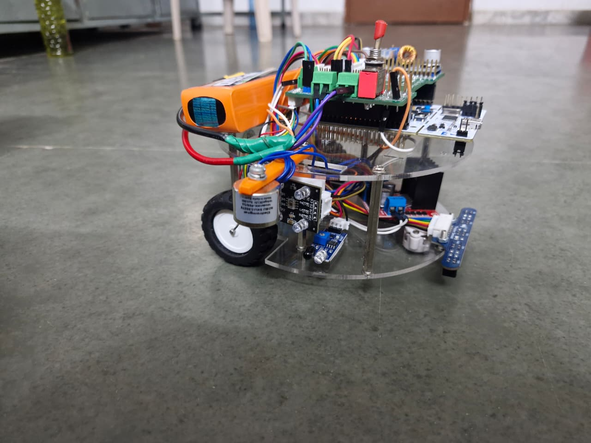
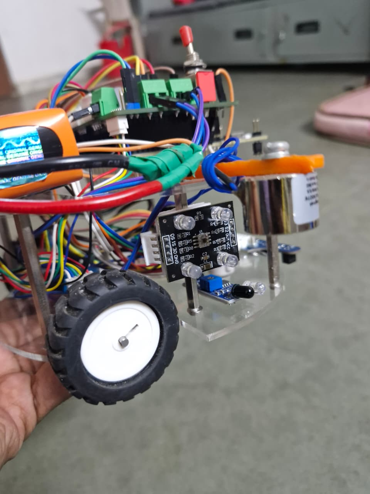

# 🌾 CropDrop Bot — e-Yantra Robotics Competition 2025-26

> An autonomous line-following and object-delivery robot that simulates agricultural logistics, built for the **e-Yantra Robotics Competition (eYRC 2025-26)** conducted by **IIT Bombay**.  
> 🏆 **Achieved Level 2 — Certificate of Completion | Top 10–30 ranked team nationally**


##  Demonstration Video

▶️ **[Click Here Watch Full Demonstration](https://youtu.be/FEBY0ZmixHQ?si=CmhnEGLUDZuSo8Nm)**

---

### Electronics & PCB — Top View


*Bird's-eye view of the electronics layer — eYRC 2025-26 CropDrop Bot custom PCB,
STM32 Nucleo F103RB, buck module (voltage regulation), Pro:Range 2200mAh 3S LiPo
battery, toggle power switch, and electromagnet mounted on the laser-cut acrylic chassis*

---

### Robot — Side View


*Fully assembled CropDrop Bot — dual-layer circular acrylic chassis (Fusion 360 design,
laser cut), N20 drive motors with rubber wheels, electromagnet at front, eYRC custom PCB
and STM32 Nucleo on the top layer*

---

### Sensors — Front Close-Up


*Front sensor array — TCS3200 color sensor (LED ring visible) for crate color
identification, IR sensor module for line detection, N20 motor with rubber wheel,
and the cylindrical electromagnet for crate pickup and drop*

---

## 1. Competition Overview

| Field | Details |
|---|---|
| Competition | e-Yantra Robotics Competition (eYRC) |
| Edition | 2025–26 |
| Theme | **CropDrop Bot** |
| Organized by | ERTS Lab, Dept. of Computer Science & Engineering, IIT Bombay |
| Institution | Amrita Vishwa Vidyapeetham, Amritapuri, Kerala |
| Achievement | **Level 2 — Certificate of Completion** |
| Rank | Top 10–30 teams nationally |
| Sponsored by | MHRD, Government of India (NMEICT) |

### 🏅 Certificate Level Matrix

| Level | Certificate | Description |
|---|---|---|
| **Level 1** | Certificate of Merit | Top 1–10 teams |
| **Level 2 ✅** | **Certificate of Completion** | **Top 10–30 teams — Our Achievement** |
| Level 3 | Certificate of Participation | Partial completion |
| Level 4 | Letter of Participation | Basic participation |

---

## 2. Theme Description

**CropDrop Bot** simulates an autonomous agricultural logistics robot that:

- Starts at a **designated supply depot**
- Navigates a **white-line track** representing farm pathways (curves, zigzag sections, and dotted/discontinuous segments)
- Detects and collects **color-coded crates** (each with a specific delivery priority)
- Transitions to a **black-line track** simulating village transportation lanes
- Identifies the correct **Drop Zone** for each crate and delivers it precisely

### 🎯 Key Challenges

- Reliable line tracking across varying path geometries (curves, zigzags, dotted lines)
- Accurate **color-based crate identification** using a TCS3200 color sensor
- Precise **pickup and drop actuation** using an electromagnet
- Efficient **task sequencing** with PID/RL-based control

### 📚 Theme Learning Areas

`PID Control` · `Reinforcement Learning` · `Python` · `Embedded-C` · `Build-a-Bot`

---

## 3. Team

| Member | Role & Contribution |
|---|---|
| **Manjari M** | Reinforcement Learning (RL) — trained the RL agent for navigation decisions |
| **Tanishk Choudhary** | Turning Logic — implemented reliable turning at intersections and corners |
| **Viswajit Arunkumar** | Mechanical Design + Box Color Identification + Pickup Logic — built the robot chassis, integrated TCS3200 color detection, and programmed electromagnet pickup/drop |
| **Tharaneeswarar MS** | PID Control for Line Following — tuned and implemented the PID controller for smooth and accurate line tracking |

---

## 4. System Overview

```
┌──────────────────────────────────────────────────────────────────┐
│                       CropDrop Bot System                        │
│                                                                  │
│   Start at Supply Depot                                          │
│           ↓                                                      │
│   White-Line Tracking (PID Controller)                           │
│   ├── Straight paths                                             │
│   ├── Curves & Zigzags                                           │
│   └── Dotted/Discontinuous segments                              │
│           ↓                                                      │
│   Color Sensor (TCS3200) → Identify Crate Color/Priority         │
│           ↓                                                      │
│   Electromagnet → Pick Up Crate                                  │
│           ↓                                                      │
│   Black-Line Tracking → Navigate to Drop Zone                    │
│   (Turning Logic + RL-based decisions)                           │
│           ↓                                                      │
│   Identify Correct Drop Zone → Release Crate                     │
│           ↓                                                      │
│   Return to Depot / Next Task                                    │
└──────────────────────────────────────────────────────────────────┘
```

---

## 5. Hardware Components

| Component | Qty | Purpose |
|---|---|---|
| STM32 Nucleo F103RB | 1 | Main microcontroller |
| STM32 mini USB Cable | 1 | Programming & power |
| N20 Motor | 2 | Drive wheels |
| Motor Driver L298N | 1 | Motor speed & direction control |
| N20 Wheel | 2 | Drive wheels |
| Mounting Bracket Motors | 2 | Motor mounting |
| Castor Wheel | 1 | Front support wheel |
| Line Following Sensor | 1 | White/black line detection |
| TCS3200 Color Sensor | 1 | Crate color identification |
| IR Sensor Module | 1 | Obstacle / proximity detection |
| Electromagnet | 1 | Crate pickup and drop |
| Mosfet Driver | 1 | Electromagnet switching |
| LiPo 3-cell 12V Battery | 1 | Power supply |
| RGB LED | 1 | Status indicator |
| Battery Balance Charger | 1 | Battery management |
| Xt60 Male Wire Extender (15cm) | 1 | Battery connection |
| Battery Voltage Tester | 1 | Voltage monitoring |
| Jumper Wires (M-M, M-F, F-F) | 60 | Connections |
| CropDrop Bot PCB | 1 | Custom PCB for integration |
| Buck Module (on PCB) | 1 | Voltage regulation |
| Toggle Switch (on PCB) | 1 | Power on/off |
| Resistor 300Ω (on PCB) | 3 | Current limiting |
| Studs, Nut & Bolt | 6 studs / 20 screws | Chassis assembly |
| Foam Boxes | 6 | Crates for delivery task |
| A4 Chart Paper (Red, Green, Blue) | 2 | Color identification targets |
| 5×5 cm Metal Sheet | 6 | Electromagnet pickup targets |

---

## 6. My Contributions

### Mechnical Design

The robot chassis was designed from scratch using Fusion 360 and fabricated as a dual-layer laser-cut acrylic structure. The two-tier layout separates the battery and motor layer (bottom) from the electronics and sensor layer (top), ensuring clean wiring, easy access for maintenance, and a stable low center of gravity during fast line-following maneuvers


### Color Identification & Pickup 

The **TCS3200** color sensor reads RGB frequency values from the crate surface:
- Compares readings against calibrated thresholds for Red, Green, and Blue crates
- Maps each color to its delivery priority
- Triggers the **electromagnet** (via MOSFET driver) to pick up the metal sheet on the crate
- Releases the electromagnet at the correct drop zone

Priority Weighted Sequence is given based on following formula:
---> Priority = Summation[Package Weightage] * Box Picked and Placed.
Where the weightage is as follows: R:50 | B:30 | G:10.
and the Priority sequence is the number of correct packages delivered in the continuous sequence of the entire theme; The Priority Sequence is  R-B-G

---

## 7. How It Works

**Step 1 — Startup:** Robot powers on at the supply depot. RGB LED indicates ready state.

**Step 2 — Farm Path Navigation:** PID/RL controller follows the white-line track through curves, zigzags, and dotted segments.

**Step 3 — Crate Detection:** At each crate location, the TCS3200 reads the crate color. Priority is determined (Red > Green > Blue or per task specification).

**Step 4 — Pickup:** Electromagnet is energized via MOSFET driver, attracting the metal sheet on the crate base and lifting it.

**Step 5 — Village Lane Navigation:** Robot transitions to the black-line track. RL agent and turning logic handle intersection decisions toward the correct Drop Zone.

**Step 6 — Delivery:** Robot identifies the correct Drop Zone by color/marker, de-energizes the electromagnet, and releases the crate.

**Step 7 — Repeat:** Returns for the next crate in priority order until all deliveries are complete.

---


---

## 8. Certificate

📄 The official **e-Yantra Certificate of Completion (Level 2)** is available in this repository:
👉 [`certificate/eYRC_2025-26_CropDropBot_Certificate.pdf`](Certificate_of_Completion/Certificate.pdf)

**Certificate Details:**
- **Recipient:** Viswajit Arunkumar
- **Institution:** Amrita Vishwa Vidyapeetham, Amritapuri, Kerala
- **Competition:** e-Yantra Robotics Competition (eYRC 2025–26)
- **Theme:** CropDrop Bot
- **Level:** Level 2 — Certificate of Completion (Top 10–30 nationally)
- **Issued by:** Prof. Shivaram Kalyanakrishnan, Principal Investigator, e-Yantra, IIT Bombay
- **Certificate ID:** EYRC2025-261776172716.80626BQJBIDI

---

## 🛠️ Technologies Used

| Category | Technology |
|---|---|
| Microcontroller | STM32 Nucleo F103RB |
| Firmware Language | Embedded-C |
| High-level Logic | Python |
| Line Following | PID Control |
| Navigation Decisions | Reinforcement Learning |
| Color Detection | TCS3200 (RGB frequency sensing) |
| Actuation | Electromagnet + MOSFET Driver |
| Motor Control | L298N Motor Driver |
| Power | LiPo 3-cell 12V + Buck converter |
| Custom PCB | CropDrop Bot PCB |

---

*Developed for e-Yantra Robotics Competition 2025–26 · IIT Bombay · Team: Manjari M, Tanishk Choudhary, Viswajit Arunkumar, Tharaneeswarar Ms*
